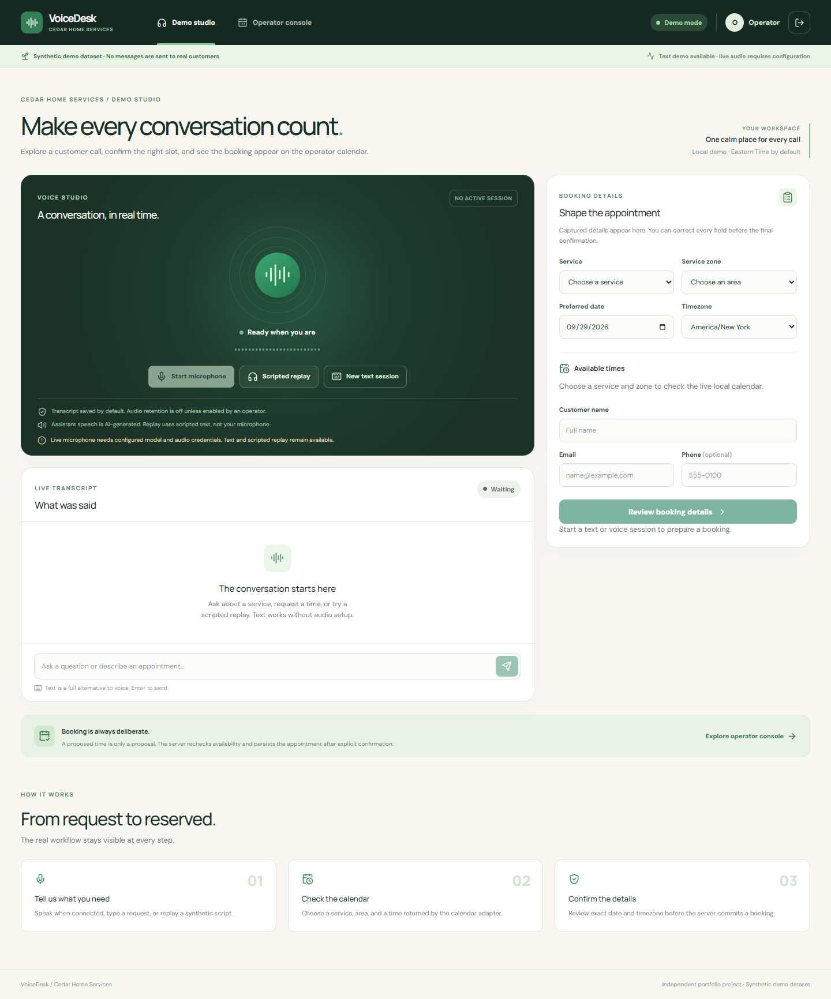

# VoiceDesk

> A voice receptionist and booking console for service teams.



[Getting started](#getting-started) · [Architecture](docs/ARCHITECTURE.md) · [Evaluation](docs/EVALUATION.md) · [Security](docs/SECURITY.md)

## Overview

VoiceDesk is an independent portfolio project: a browser voice receptionist and booking console for **Cedar Home Services**, a fictional maintenance business. The seeded customers, appointments, transcripts, and outbox are a **Synthetic demo dataset**. No demo action sends a real message or payment.

### Core workflow

**Conversation → availability → confirmation → booking → operator review**

### Capabilities

- Audio and text conversation paths
- Confirmation-gated scheduling and cancellation
- Operator view with transcripts and booking context

### Technology

FastAPI · React · LangGraph · PostgreSQL · browser audio

### Evidence and scope

The synthetic demo seed, 600 appointment invariants and 20 scripted audio fixtures passed local checks. See implementation status for connected-mode limits. The included demo uses synthetic data and local simulators. Deployment and live-provider limits are documented in [implementation status](docs/IMPLEMENTATION_STATUS.md).

## Getting started

Run the local demonstration from the repository root using the project-specific instructions below. External service credentials are needed only for connected integrations.

### Run the full demo with Docker

Prerequisites: Docker Engine with Compose, and enough disk space for PostgreSQL and the web/API builds. Copy `.env.example` to `.env`, replace `APP_SECRET_KEY` and `POSTGRES_PASSWORD` with unique values, then run this one command from this directory:

```sh
docker compose up --build
```

Open [VoiceDesk](http://localhost:8080). The API documentation is at [OpenAPI](http://localhost:8000/docs). Demo account details and the verified feature matrix are in [HANDOVER.md](docs/HANDOVER.md). First startup migrates the database and seeds the complete synthetic dataset; subsequent starts preserve bookings. `DEMO_DATA_SIZE=quick` in `.env` shortens local development seeding. Use the explicit demo reset procedure only for demo workspaces.

To reset the two synthetic DEMO workspaces after stopping demo calls: `docker compose exec api python -m voicedesk.reset_demo --confirm`. This does not reset a CONNECTED installation.

Demo operator: `operator@cedar.example.com` / `DemoVoiceDesk2026!`. The admin and viewer use the same synthetic password with `admin@cedar.example.com` and `viewer@cedar.example.com`; `operator@harbor.example.com` belongs to an isolated second workspace. Change or remove these accounts outside DEMO.

### Windows PowerShell preparation

```powershell
Copy-Item .env.example .env
notepad .env
docker compose up --build
```

### POSIX shell preparation

```sh
cp .env.example .env
${EDITOR:-vi} .env
docker compose up --build
```

## Local demo without Docker

This is an explicit SQLite DEMO fallback for development and visual review. It does not replace PostgreSQL concurrency and recovery verification. Use Python 3.12, [uv](https://docs.astral.sh/uv/), Node.js 24, and pnpm 11.19.0. In one terminal:

```powershell
cd apps/api
$env:APP_MODE = 'demo'
$env:DATABASE_URL = 'sqlite:///./voicedesk-demo.db'
$env:DEMO_DATA_SIZE = 'full'
uv sync --frozen
uv run alembic upgrade head
uv run python -m voicedesk.seed
uv run uvicorn voicedesk.main:app --reload --port 8000
```

In another PowerShell terminal:

```powershell
cd apps/web
pnpm install --frozen-lockfile
pnpm dev
```

The POSIX equivalent:

```sh
cd apps/api
export APP_MODE=demo DATABASE_URL=sqlite:///./voicedesk-demo.db DEMO_DATA_SIZE=full
uv sync --frozen
uv run alembic upgrade head
uv run python -m voicedesk.seed
uv run uvicorn voicedesk.main:app --reload --port 8000
```

Then, in a second terminal:

```sh
cd apps/web
pnpm install --frozen-lockfile
pnpm dev
```

Open `http://localhost:5173`. On a restricted Windows installation where uv cannot use the profile cache, set `UV_CACHE_DIR` to a writable project directory and explicitly select a Python 3.12 interpreter with `uv sync --python <absolute-python-path>`.

## Modes and scope

- `APP_MODE=demo`: deterministic semantic fixtures, local calendar, demo outbox, synthetic records, no external writes.
- `APP_MODE=connected`: configured model/audio providers and an optional Google Calendar adapter. Credentials and model IDs are environment configuration. A failed live request is shown as a failure, never converted into fixture success.

For a fresh CONNECTED installation, set `APP_MODE=connected`, a unique `APP_SECRET_KEY`, `OPENAI_API_KEY` and any calendar settings in `.env`, then start Compose and run the one-time interactive Cedar pilot bootstrap:

```sh
docker compose up --build
docker compose exec api python -m voicedesk.bootstrap_connected --email admin@your-domain.example
```

The second command prompts for a new password of at least 12 characters. It creates the fictional Cedar service catalogue and one admin, with no demo accounts or synthetic customers/appointments. Use the admin to sign in, then replace pilot catalogue/policy values with the customer's approved configuration before real calls. The noninteractive option `VOICEDESK_BOOTSTRAP_PASSWORD` is intended only for a secret-managed automation environment; do not place it in committed files.

The studio supports text access to the voice workflow. Audio requires browser microphone permission and a configured live provider for a live call; the demo replay is labelled separately. Telephony, outbound calling, payment collection, and languages other than English are outside v1.

## Documentation

- [Product](docs/PRODUCT.md), [Architecture](docs/ARCHITECTURE.md), [API](docs/API.md), [Data card](docs/DATA_CARD.md), [Evaluation](docs/EVALUATION.md)
- [Operations](docs/OPERATIONS.md), [Security](docs/SECURITY.md), [Dependencies](docs/DEPENDENCIES.md), [Commercialization](docs/COMMERCIALIZATION.md)
- [Portfolio case study](docs/PORTFOLIO.md), [Handover](docs/HANDOVER.md), [Implementation status](docs/IMPLEMENTATION_STATUS.md)

This is a commercial pilot starting point, not an assertion of production readiness. The handover records tested limits and deployment work still required.


