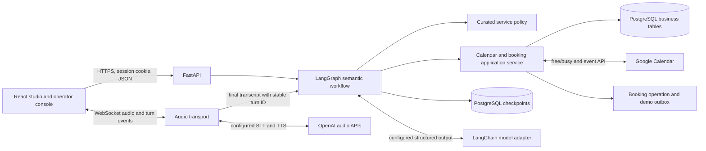
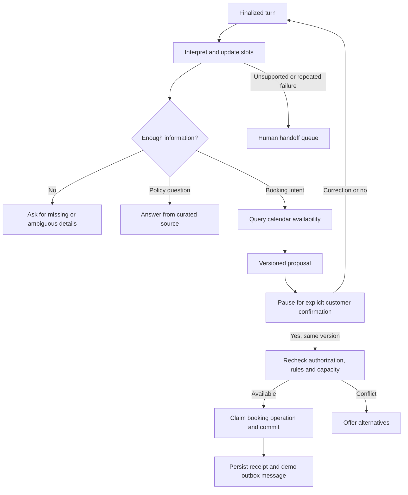
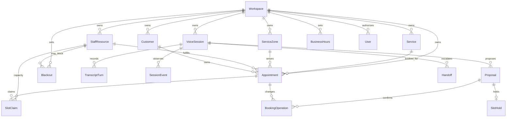

# Architecture

VoiceDesk is a self-hostable modular monolith for one customer installation. Every business record carries a workspace ID; the demo seeds two isolated fictional workspaces. The UI has a studio for a caller and a console for an operator. FastAPI owns authorization and all business mutations. PostgreSQL is the deployment database; the explicitly labelled SQLite fallback is for local demo checks only.

The graph handles finalized semantic turns: interpretation, slot collection, clarification or policy lookup, availability, proposal, customer confirmation, revalidation, commit, and factual outcome. Frames and partial transcripts stay in the streaming transport. The browser may interrupt playback at once; the server rejects an action associated with an invalidated proposal or superseded turn.

## Data model

The graph's thread ID and session ID are locators, never authorization. An authenticated request must verify workspace and role before it can read, stream, or resume either. Booking confirmation carries the proposal version and an idempotency key. The server rechecks current appointment state and available capacity in the same operation that claims a local slot. External provider calls are recorded with observable states so an ambiguous timeout can be reconciled rather than blindly repeated.

## Boundaries and limitations

- DEMO uses fictional data and local simulators. The connected adapter requires separately configured provider credentials and an explicit spending limit for live tests.
- Google Calendar free/busy and event writes cannot be atomic with unrelated calendar writers. External conflicts must be reconciled.
- No telephony, outbound calls, payment collection, or multilingual flow is in v1.
- Audio is not retained by default. A customer's retention settings, reverse proxy TLS, backups, and secrets management are deployment responsibilities.

See the four [architecture decisions](adr/001-audio-and-semantic-state.md) for the reasons and tradeoffs.

